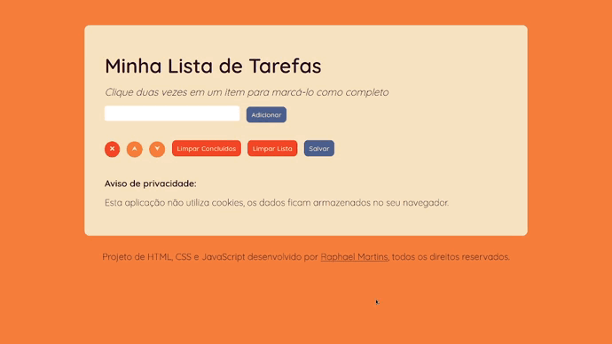
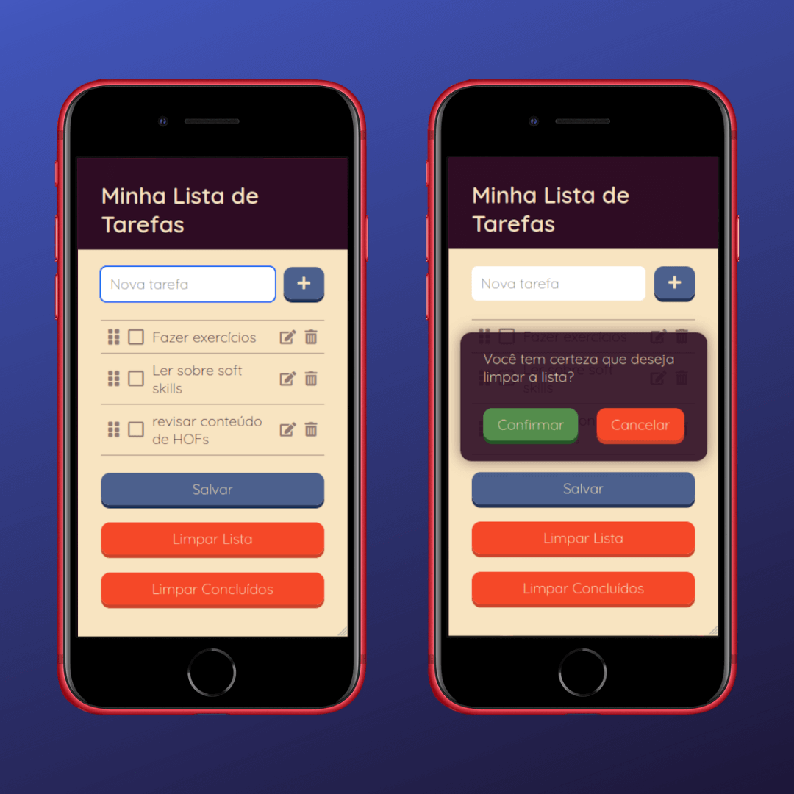
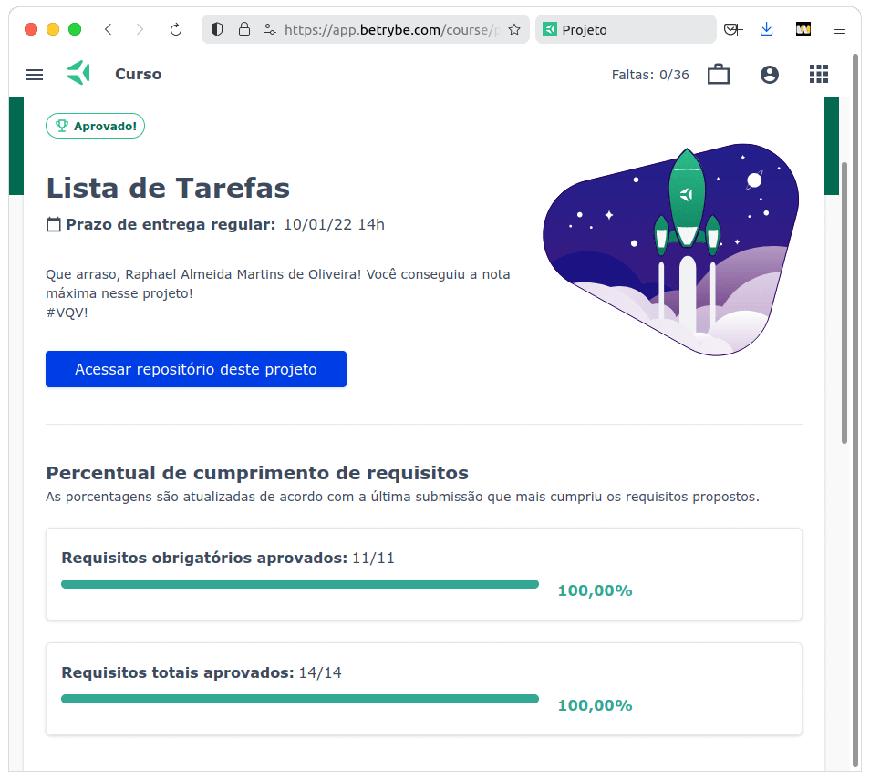

# :pushpin: To-do List

## :page_with_curl: About/Sobre

  
<strong>:us: English</strong>
 

Project of HTML, CSS, and JavaScript developed by me ([Raphael Martins](https://www.linkedin.com/in/raphaelameidamartins/)) at the end of Unit 5 ([Principles of Web Development Module](https://github.com/raphaelalmeidamartins/trybe_exercicios/tree/main/1_fundamentos-do-desv-web)) of [Trybe](https://www.betrybe.com)'s Web Development course. I was approved with 100% of the mandatory and optional requirements met.

We developed a dynamic and interactive web page with a to-do list application. The user can change the order of the list items, mark them as completed, or delete them. It's also possible to save the list, so when the user enters the page again, it is the same way as it was left.

[Click here](https://raphaelalmeidamartins.github.io/to-do-list/) to check out the final version of the project on your browser.
 

  
<strong>:brazil: Português</strong>
 

Projeto de HTML, CSS e JavaScript desenvolvido por [Raphael Martins](https://www.linkedin.com/in/raphaelameidamartins/) ao final do Bloco 5 ([Módulo Fundamentos do Desenvolvimento Web](https://github.com/raphaelalmeidamartins/trybe_exercicios/tree/main/1_fundamentos-do-desv-web)) do curso da Trybe. Fui aprovado com 100% dos requisitos obrigatórios e opcionais atingidos.

Tivemos que desenvolver uma página dinâmica com uma aplicação de lista de tarefas. O usuário pode mudar a ordem dos itens da lista, marcá-los como concluídos ou deletá-los. Também é possível salvar a lista para que quando o usuário acesse novamente, esteja como antes.

[Clique aqui](https://raphaelalmeidamartins.github.io/to-do-list/) para conferir a versão final do projeto no seu navegador.
 

## :man_technologist: Developed Skills

  
<strong>:us: English</strong>
 

* Use the DOM API to access HTML elements
* React to user interations by using event listeners
 

  
<strong>:brazil: Português</strong>
 

* Usar a API DOM para acessar os elementos HTML
* Reagir a interações do usuário utilizando escutadores de eventos
 

## :hammer_and_wrench: Tools/Ferramentas

* HTML5
* CSS3
* JavaScript ES6+
* Font Awesome (icon library)

## :iphone: Mobile version/Versão mobile

## :trophy: Grade/Nota

### :copyright: Copyright disclaimer/Aviso de direitos autorais

  
<strong>:us: English</strong>
 

I developed this project for learning purposes, all the code and documentation texts in Portuguese and English are my authorship, and the rights belong exclusively to me. It is allowed to download or clone the repository for study purposes. However, it is not allowed to publish full or partial copies. This disclaimer does not cover libraries and dependencies, which are subject to their respective licenses.
 

  
<strong>:brazil: Português</strong>
 

Desenvolvi esse projeto para propósitos de aprendizagem, todo o código e documentação são de minha autoria e os direitos pertencem exclusivamente a mim. É permitido baixar ou clonar o repositório para fins de estudo. Contudo, não é permitido publicar cópias totais ou parciais. Este aviso não cobre bibliotecas e dependências, estas estão sujeitas a suas respectivas licenças.
 

